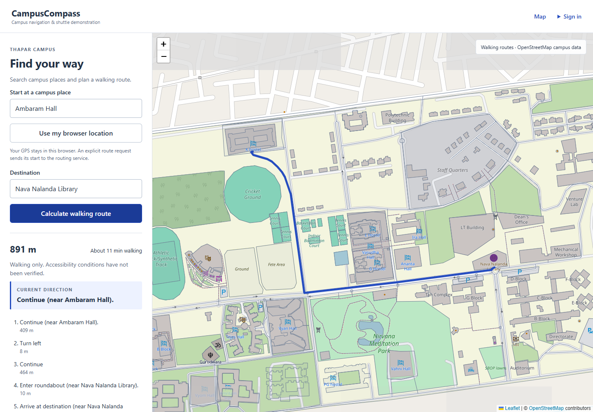
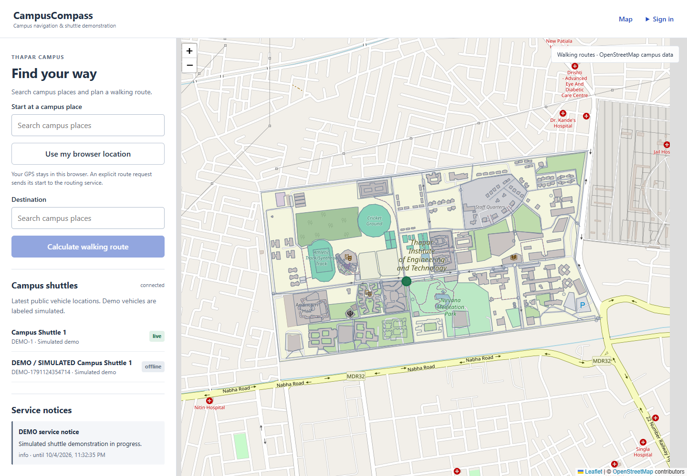
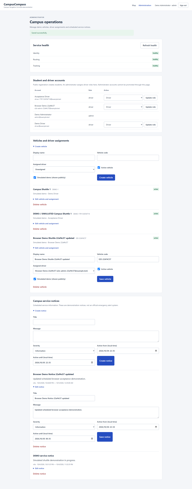
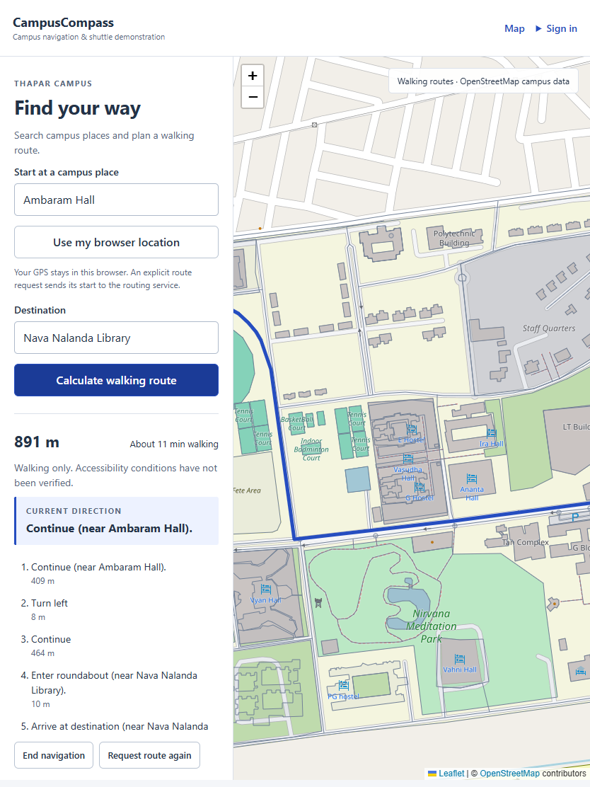
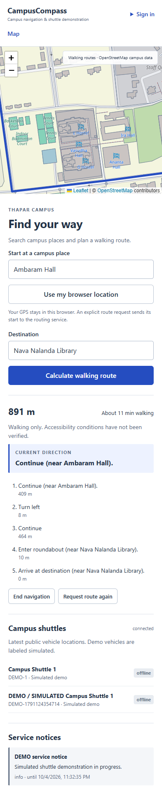
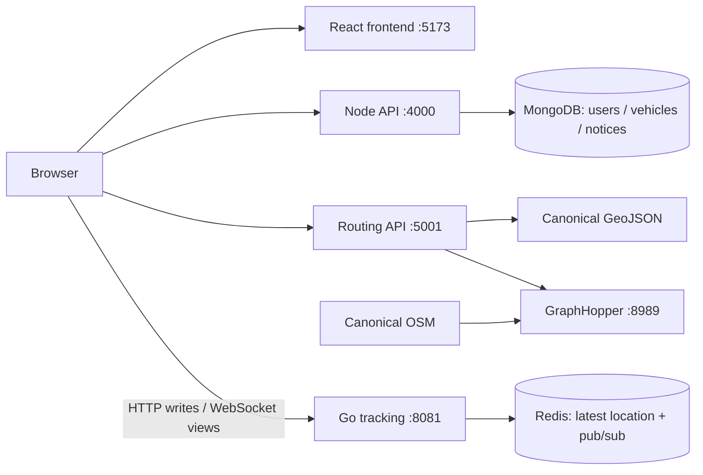

# CampusCompass

Campus walking navigation with local place search, GraphHopper routes, landmark directions and an authenticated **simulated shuttle** demonstration.

**Validation status:** all five application images built and all seven Compose services passed health checks on Docker Engine 29.8.2. Real container GraphHopper routing, MongoDB/Redis/WebSocket acceptance, four Chrome workflows, engine outage/recovery, and Linux Go race tests with Redis 7.4.7 passed. Publication and hosted CI are the remaining release steps. See [validation evidence](docs/VALIDATION.md).

## Overview

Visitors can search the inherited Thapar campus dataset, choose a campus start or opt into browser GPS, and deliberately request a walking route. Authorized drivers can publish their assigned vehicle's location. Administrators manage vehicle metadata, driver assignments and scheduled service notices.

Application search, routing, authentication and tracking run locally. Raster tiles need internet. The shuttle uses synthetic accounts and simulated movement; no campus fleet feed is connected.

## Architecture Reality

MapMitra contained partially connected experiments with mismatched APIs, external dependencies, mock locations and unsupported documentation claims. CampusCompass replaces those active paths with defined and tested contracts. These audits describe the immutable upstream snapshot:

- [Upstream delta and preserved ancestry](docs/UPSTREAM_DELTA.md)
- [Architecture claims audit](docs/ARCHITECTURE_REALITY_AUDIT.md)
- [Retired experiments](docs/RETIRED_UPSTREAM_EXPERIMENTS.md)
- [Active API contracts](docs/API_CONTRACTS.md)

## Upstream MapMitra Foundation

Inherited concepts and material include the React/Leaflet map, campus GeoJSON and OSM extract, GraphHopper experiment, landmark routing concept, Node user backend, Redis/Go ride experiment and administration UI concept. Original history and attribution are preserved. CampusCompass does not claim original authorship of these concepts or the campus map.

## CampusCompass Additions

- One canonical dataset and validated local POI index; deterministic search without a public geocoder.
- Async walking routing, bounded engine calls, safe errors and landmark instructions.
- Opt-in GPS cleanup, manual starts, route progress, accuracy feedback and explicit rerouting.
- Password authentication, server-controlled roles and separate vehicle-bound tracking grants.
- Mongo-backed vehicle/driver assignment and scheduled notice administration.
- Actual Redis latest-position expiry, pub/sub and WebSocket map updates.
- Explicit driver publishing, reconnect snapshots and live/stale/offline states.
- Regression tests, real-service acceptance scripts, container definitions and CI checks.

## Screenshots

Actual Chrome captures were refreshed against the complete container stack using synthetic identities. OpenStreetMap tiles, canonical campus vectors and real GraphHopper routes are visible. These are not mockups.







<details><summary>Tablet and mobile</summary>





</details>

## Technology Stack

React 18, Vite and React Leaflet/Leaflet; Node 24, Express 5, Mongoose, bcrypt and JWT; Python/FastAPI, HTTPX and Shapely; GraphHopper 10.2 on Java 21; Go, Redis and WebSockets. Compose targets MongoDB 8.0.18 and Redis 7.4.7. Vitest/React Testing Library, node:test/Supertest, pytest, Go tests and Playwright cover their respective boundaries. Lockfiles and Python requirements pin resolved dependencies.

## Architecture



The browser uses three API boundaries. MongoDB, Redis and GraphHopper have no host-published ports in Compose.

## Service Responsibilities

| Service | Responsibility | Readiness |
| --- | --- | --- |
| Frontend | Map, search, navigation and role-specific forms | nginx /health |
| Node API | Accounts, roles, vehicle metadata, assignments, notices and grants | Mongo ping |
| Routing API | Data validation, POIs, async routes and landmarks | Engine walking profile |
| GraphHopper | OSM graph import and walking paths | Engine /health |
| Go tracking | Authorized positions, snapshots and WebSocket viewers | Redis and stream checks |
| MongoDB | Identity and administration metadata; no GPS | Mongo ping |
| Redis | Temporary latest points and pub/sub | Redis ping |

## Local Campus Search

The routing service derives 106 POIs from the 395-feature GeoJSON, validating geometries, extracting names/aliases and selecting suitable anchors. Search ranks exact, prefix, word-prefix and substring matches with stable ties. The browser obtains this index once and ranks locally as the user types, without a second bundled dataset.

Public Nominatim client autocomplete is removed. This campus-sized index serves searches locally. See [algorithms](docs/ROUTING_AND_POI_ALGORITHMS.md).

## Routing

`POST /api/routes` accepts `{start:{lat,lng},destination:{lat,lng},profile:"walking"}`. HTTPX calls local GraphHopper asynchronously with connection/read timeouts and an overall deadline. Output contains GeoJSON coordinates in longitude/latitude order, distanceMeters, durationSeconds and instructions with point/text/distanceMeters. Invalid, unavailable and no-path results have safe errors.

Walking is the sole profile. Duration is an engine estimate without measured predictive accuracy. GPS samples update progress and deviation feedback without initiating route requests. Three adequate off-route fixes prompt an explicit route request; poor fixes pause progress. Instructions advance near the next maneuver.

## Landmark Directions

The closest eligible named POI within 45 meters supplies a cue, using Haversine distance and deterministic ties. Without a suitable landmark, the original instruction is preserved. Map age and POI anchors limit these cues. Landmark guidance supplements the engine instructions.

## Live Vehicle Tracking

Node checks current driver role, active vehicle and assignment before issuing a tracking JWT. The grant has a distinct secret, issuer/audience/purpose and at most 120 seconds of validity. Go verifies it before accepting bounded coordinates. Access tokens and grants for other vehicles cannot publish.

Server-stamped positions atomically replace `vehicle:{vehicleId}:latest`, renew a 120-second TTL and publish an event via Redis Lua. There is no location history; Compose disables Redis persistence.

The map takes a snapshot then receives actual WebSocket updates, reconnecting with a fresh snapshot and bounded backoff. Broker arrival order controls updates; server time controls freshness: live below 30 seconds, stale through 120 seconds, then offline without a marker. Public messages omit driver account data. No replacement coordinates are invented. Pub/sub has no outage replay guarantee.

The optional [simulator](scripts/simulate-shuttle.mjs) authenticates as an assigned fake driver through the same HTTP API. It refuses vehicles without simulated:true. Its deterministic loop is visibly labeled simulated.

## Geolocation Privacy

Normal users' continuous location remains browser-local. A deliberate route/reroute sends its start coordinate to routing; no visitor GPS history is stored. Authentication and MongoDB receive no GPS.

An explicit action enables one watch. Stop, mode change, navigation end and unmount clear it. Inline denied/unavailable/timeout/unsupported states allow a manual campus start. Driver publishing is separate and stops on logout, leaving its page or authorization failure. Tokens remain in browser memory, absent from local storage and URLs.

Published vehicle coordinates are public shuttle information, latest-only for up to 120 seconds in Redis. Transport encryption and reverse-proxy logging require configuration before use beyond loopback development.

## Authentication and Roles

Registration accepts name/email/password and always creates a student. Unknown fields and selected roles are rejected. Passwords use bcrypt with 12 rounds and byte limits to prevent truncation. Access JWTs expire after 15 minutes; protected Node requests check the current Mongo role.

Visitors navigate without signing in. Administrators promote drivers and assign vehicles. A private server seed creates an admin, refusing to silently promote an existing ordinary user. No active OAuth, Firebase or refresh-token flow exists. Reloading requires login again.

## Admin

Forms support vehicle create/edit/delete, activation, simulation labels, unique driver assignments, student/driver role changes and scheduled notice CRUD with severity. Assigned drivers must be unassigned before demotion. Backend authorization remains authoritative.

Notices are informational; they do not change route weights or send emergency alerts. Mongo indexes enforce unique vehicle codes and one vehicle per driver. Per-driver mutation locks apply within the single API process; multiple API replicas need transaction-based coordination.

## Docker Compose

The root file defines seven used services with readiness dependencies, distinct ports, read-only campus data and named Mongo/graph volumes. nginx serves the built frontend. Database/engine ports remain inside the network. The official GraphHopper jar is SHA-256 checked and its Apache license retained in the image definition.

The complete stack has been built and started using Docker Engine 29.8.2 / Compose 5.6.0 in a dedicated WSL Ubuntu environment. All seven services became healthy, and the browser and actual-service checks ran against these containers. The Windows host needed a private proxy configuration and build-only host-network overlay; the runtime used the unmodified Compose file. See [Windows environment details](docs/WINDOWS_CONTAINER_SETUP.md).

## Data Sources and Licensing

| Material | License and attribution |
| --- | --- |
| Application source | MIT; **Copyright (c) 2024 Yash Dogra** in root [LICENSE](LICENSE) |
| OSM-derived campus databases and POI data | ODbL 1.0; © OpenStreetMap contributors |
| GraphHopper | Apache 2.0; separate dependency license/notices |

Canonical files preserve the richer upstream GeoJSON and its OSM extract. Original export steps, extraction date and campus survey authorization are unestablished. Object edit timestamps do not prove a current survey. Matching coordinates strongly support OSM derivation. This migration changes no inherited coordinates.

See [provenance, hashes and evidence](docs/DATA_LICENSE_AND_PROVENANCE.md) and [data README](data/README.md). Source MIT does not relicense databases or dependencies.

## OpenStreetMap Attribution

The map visibly credits [© OpenStreetMap contributors](https://www.openstreetmap.org/copyright). Preserve attribution when changing tile sources or sharing images. Public tiles are subject to the [OSMF tile policy](https://operations.osmfoundation.org/policies/tiles/). The application does not bulk download or prefetch tiles; select a suitable provider for broader deployment.

## Installation

The intended Compose setup needs Docker Engine/Compose v2 and Python 3.12+ for configuration generation. Node 24 runs optional acceptance/simulation tools. From the root:

```sh
python scripts/init-env.py
docker compose config --quiet
docker compose build
docker compose up -d
docker compose ps
docker compose exec api node src/seed.js
```

Open http://localhost:5173. The initializer creates random distinct secrets and synthetic passwords in ignored .env without printing them, and refuses to overwrite an existing file. Sign in with ADMIN_EMAIL and private ADMIN_PASSWORD. Keep a WSL session running when using the dedicated Windows engine, as described in the environment guide.

Optional synthetic driver/vehicle and simulation:

```sh
node --env-file=.env scripts/seed-demo.mjs
# Add the printed DEMO_VEHICLE_ID to private .env.
# Optionally set DEMO_SAMPLES=8 for a finite run; otherwise stop with Ctrl+C.
node --env-file=.env scripts/simulate-shuttle.mjs
```

The simulator session expires after 15 minutes; relaunch to authenticate again. Use `docker compose down` to stop containers while preserving data. Component READMEs document native development: [frontend](frontend/README.md), [Node](backend/README.md), [routing](routing-backend/README.md), [tracking](tracking/README.md). Provide actual MongoDB, Redis and Java/GraphHopper separately. Platform binaries, graph caches and databases are untracked.

## Environment Variables

[.env.example](.env.example) is the template. Secrets belong in ignored root .env. All VITE settings are public build-time values.

| Setting | Purpose |
| --- | --- |
| JWT_SECRET | Access signing; at least 32 characters |
| TRACKING_JWT_SECRET | Tracking signing; at least 32 characters and distinct |
| ADMIN_EMAIL / ADMIN_PASSWORD | Trusted synthetic admin seed |
| DEMO_EMAIL / DEMO_PASSWORD / DEMO_VEHICLE_ID | Optional fake driver and simulator |
| CORS_ORIGINS | Explicit frontend origins; localhost:5173 default |
| MONGO_URI / GRAPHHOPPER_BASE_URL / REDIS_ADDR | Native addresses; Compose supplies internal addresses |
| CAMPUS_DATA_DIR | Repository data by default; /data in Compose |
| VITE_API_URL / VITE_ROUTING_API_URL / VITE_TRACKING_API_URL | Browser API bases |
| VITE_TRACKING_WS_URL | Public ws/wss endpoint |
| VITE_TILE_URL | Raster tile template |

Match origins to frontend scheme/port. Browser GPS requires a secure context, including localhost; non-local deployment needs HTTPS/WSS.

## Testing

Install dependencies in each component and run from its directory:

```sh
# frontend: npm ci --ignore-scripts
npm run lint
npm test
npm run build
# backend: npm ci
npm run lint
npm test
# routing-backend: pip install -r requirements-dev.txt
python -m ruff check api tests
python -m ruff format --check api tests
python -m pytest -q
# tracking: set TRACKING_TEST_REDIS_ADDR for actual Redis
go vet ./...
go test -race ./... -count=1
```

Node tests use a disposable Mongo binary or MONGO_TEST_URI with a unique test database. Go's actual Redis test explicitly skips without TRACKING_TEST_REDIS_ADDR; miniredis alone does not establish real-server integration. Routing unit tests use HTTPX MockTransport; live GraphHopper acceptance is separate.

Root checks: `python scripts/validate-campus-data.py`, `python scripts/check-boundaries.py`, `python scripts/check-release-source.py`. The last scans tracked current source without printing suspected secret values; it is not an exhaustive credential audit.

With actual services and synthetic seed ready:

```sh
cd e2e
npm ci
npx playwright install chromium
# Or set CHROME_PATH to an installed Chrome executable.
cd ..
node --env-file=.env scripts/acceptance.mjs
cd e2e
node --env-file=../.env node_modules/@playwright/test/cli.js test
```

Acceptance mutates synthetic records; use a disposable local database. See [validation](docs/VALIDATION.md) for exact versions, results and native-tool differences.

## CI

[GitHub Actions](.github/workflows/ci.yml) defines frontend lint/tests/build, Node tests with MongoDB, Python lint/tests, Go race tests with real Redis and repository config/data/source checks. Hosted routing tests mock the engine. No hosted run is claimed while publication remains gated.

## Accessibility

UI controls have labels, keyboard-operable forms, visible focus, textual statuses and walking instructions. Denied GPS permits manual navigation. Desktop/tablet/mobile checks are not a comprehensive accessibility certification.

Physical accessibility is separate. Inherited data lacks adequate wheelchair, kerb and surface evidence. Ordinary walking is offered; step-free/wheelchair suitability is not claimed. See [audit](docs/ACCESSIBILITY_ROUTING_AUDIT.md).

## Known Limitations

- Hosted CI is pending the new repository publication; local container acceptance has passed.
- Campus geometry is inherited, without a current survey or established entry permissions.
- Public tiles need internet; campus vectors render when tiles fail.
- Accessible routes and measured ETA accuracy are unestablished.
- Shuttle data is simulated; no real fleet integration.
- Existing tracking grants may remain valid up to 120 seconds after reassignment/deactivation.
- Node locks/rate counters are process-local; replication needs coordination.
- Redis pub/sub is transient and bounded, without guaranteed outage replay.
- Memory-only access tokens expire after 15 minutes; login is required again.
- Navigation has no automatic arrival shutdown; notices do not alter roads.
- Production transport, deployment, monitoring and scale are unverified.

## Roadmap

Audited accessible-route data; validated road closures; push notifications; multiple campuses; production tiles; transaction-based administration; measured tracking capacity and recovery.

## Acknowledgements

Built on [MapMitra by Yash Dogra](https://github.com/yxshee/mapmitra), with [OpenStreetMap contributors](https://www.openstreetmap.org/copyright) and the [GraphHopper routing engine](https://github.com/graphhopper/graphhopper). Their history, attribution and licenses are preserved.

## License

Application source is [MIT](LICENSE), retaining **Copyright (c) 2024 Yash Dogra**. Campus data is separately OpenStreetMap-derived under ODbL. GraphHopper and other dependencies retain their own licenses. See [license distinctions](docs/DATA_LICENSE_AND_PROVENANCE.md).
